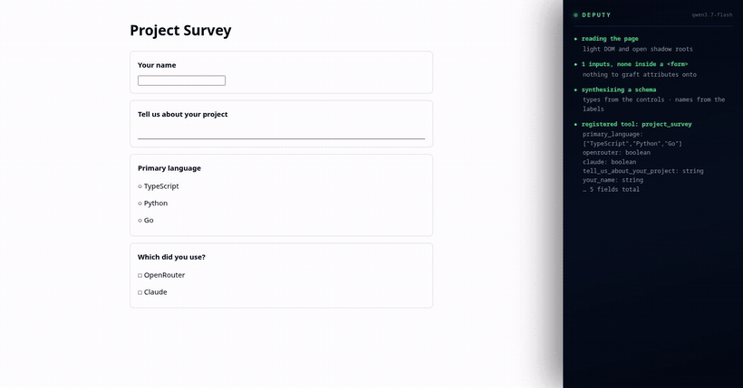

# Deputy

**We taught a website to describe itself to an agent — without its cooperation.**



*A page built the way Google Forms builds one — no `<form>`, its choices are `<div role="radio">`.
Deputy synthesizes a typed tool from it, hands the schema to an agent, and fills it from one call.
Reproduce it with `bun run demo` and `bun run dev`; full video: [`docs/deputy-demo.mp4`](docs/deputy-demo.mp4).*


Deputy is an agent that lives in your browser. Any MCP client — Claude Code, Cursor, your own agent —
stops driving the browser itself and asks Deputy instead. It hands back a **typed API** for
whatever page you are on, then performs the call in your real, logged-in session.

The page never enters the calling agent's context. No screenshot, no DOM, no accessibility tree.

---

## The idea

A `<form>` already knows everything about itself. It knows a field is a required date, that a
dropdown has exactly three options, that a number must fall between 1 and 12. We throw all of that
away when we render to pixels, and then pay a language model to infer it back from a picture.

There is a W3C standard that fixes this — **WebMCP**, shipping in Chromium 152 — which lets a site
declare its forms as agent-callable tools. Almost nobody has adopted it.

So Deputy adopts it on their behalf. It writes six HTML attributes onto the page's own form, and
then **Chromium itself** generates the JSON Schema and executes the submission:

```html
<form toolname="book_a_table" tooldescription="…">
  <input name="party_size" type="number" min="1" max="12" toolparamdescription="Party size">
```
```jsonc
// what the agent receives — generated by the browser, not by us
{ "party_size": { "type": "number", "minimum": 1, "maximum": 12 },
  "date":       { "type": "string", "format": "date" },
  "seating":    { "type": "string", "enum": ["indoor", "outdoor", "bar"] } }
```

We wrote no schema generator and no form-filler. The browser already had both.

## CopilotKit: we meet on the same standard

CopilotKit v2 ships a `WebMCPRegistry` that publishes an app's frontend tools to
`document.modelContext` — the same WebMCP registry Deputy grafts onto everything else. So the
integration needs no glue at all:

```
CopilotKit v2 app                       Deputy
  useFrontendTool(...)                    grafts <form>s and ARIA widgets
        │                                        │
        └──▶  document.modelContext  ◀───────────┘
                      │
                      └──▶ browser_capabilities → any MCP agent
```

**Both directions work, and both are real:**

- **CopilotKit → any agent.** An app's frontend tools are registered with live handlers, so Deputy
  surfaces them to Claude Code **fully executable** — not a description, the actual action. An app
  built for its own in-app copilot becomes usable by any agent, with no change to the app.
- **Deputy → CopilotKit.** Deputy's grafted tools land in the same `document.modelContext` that
  CopilotKit reads through `getWebMCPModelContext()`. A CopilotKit copilot gains tools for forms its
  developers never wired up.

For **CopilotKit v1**, which predates the WebMCP registry, Deputy falls back to reading the `actions`
manifest as the app POSTs it to `/api/copilotkit` — read-only, request passed through untouched.
Capability without cooperation, same as the rest of Deputy.

## Pages with no `<form>`

Most of the interesting web has no `<form>` element. Google Forms, React apps, anything that builds
a form out of divs. Deputy synthesizes the tool itself there — including the widgets that are not
form controls at all:

| on screen | actually in the DOM | Deputy emits |
|---|---|---|
| multiple choice | `role="radiogroup"` → `role="radio"` | `enum` |
| checkboxes | `role="checkbox"` | `boolean` |
| dropdown | `role="listbox"` → `role="option"` | `enum` |
| paragraph answer | `contenteditable` | `string` |

Measured on a Google-Forms-shaped page: **1 field captured before, 5 of 5 after.** It also queries
across open shadow roots, because a page built from web components looks empty otherwise.

Either way — real form or not — **the agent makes one typed call.** That equivalence is the point:
falling back to "click this, then type that" hands the per-step cost straight back to the caller,
which is the thing Deputy exists to remove.

## What it costs

Filling a 7-field booking form. Same prompt, same data, both through `claude -p`. Both succeeded.

| | Claude + Playwright MCP | Claude + Deputy | |
|---|---|---|---|
| turns | 9 | **6** | |
| Claude tokens | 216,888 | **133,366** | **1.63× fewer** |
| Deputy's own model | — | 1 call · **$0.000014** | |
| **total cost** | **$0.2730** | **$0.1861** | **1.47× cheaper** |
| wall clock | 26.1 s | **17.2 s** | **1.52× faster** |

Per observation, on the same Wikipedia page:

| representation | ~tokens |
|---|---|
| full accessibility tree | 215,495 |
| screenshot (PNG) | 57,134 |
| trimmed a11y snapshot *(what Playwright MCP sends)* | 14,170 |
| **Deputy's typed schemas** | **115** |

The baseline was given the accessibility-snapshot path, not just screenshots, so **the comparison is
deliberately conservative**. Method and both tasks: [`docs/measurements.md`](docs/measurements.md).

### The finding worth reading twice

`browser_capabilities` first returned tool **names only**, to keep the payload small. The agent had
to probe for parameter names: **246,003 tokens**. Returning full schemas: **155,774**. Adding *more*
still — current values, plus every button and link with a clickable ref: **133,366, 6 turns**.

**~5× more data made the task 1.8× cheaper.** Every probe an agent is forced to make costs more than
the context that would have prevented it.

## Tools the agent sees

Six, and they never change as you browse, so the caller's context stays flat.

| tool | |
|---|---|
| `browser_capabilities` | the page's contract — typed schemas, current values, clickable actions |
| `browser_invoke` | run a tool; fills and submits the real form |
| `browser_ask` | ask a question about a page; Deputy reads it and answers (~40 tokens) |
| `browser_read` | the page as text, when you need the content to reason over |
| `browser_navigate` | open a URL and report what appeared |
| `delegate_goal` | hand over a goal and let Deputy choose |

Long pages are **windowed, never silently truncated**: Wikipedia's 263 links come back as
`"Showing 1-25 of 263"` with `actionQuery` to filter and `actionOffset` to page.

## Two agents, two models

Deputy is not Claude with extra steps. It runs `qwen/qwen3.7-flash` via OpenRouter, because reading a
page and choosing a form is not work that needs a frontier model. Claude thinks; Deputy browses.

With no API key it falls back to a keyword planner and still works — the demo never depends on a
second key being up.

## Run it

```bash
bun install
cp .env.example .env       # add OPENROUTER_API_KEY (optional — it degrades without one)
bun run dev                # daemon + a Chromium carrying the extension
claude mcp add --transport http deputy http://127.0.0.1:7331/mcp
```

```bash
bun test              # 88 unit tests, never launches a browser
bun run test:browser  # 10 integration tests against real Chromium
bun run demo          # serve the example pages used in the video
bun scripts/sweep.ts  # point Deputy at 8 real sites and see what it makes of each
```

## How it's built

```
Claude Code ──MCP──▶ deputyd (Bun) ──WebSocket──▶ extension (MV3) ──▶ Chromium's own WebMCP
                       │                             │
                       ├─ registry: tabs → tools     ├─ graft: annotate real <form>s
                       ├─ tasks: A2A-shaped states   ├─ synthesize: everything else
                       └─ planner: qwen (optional)   └─ content: getTools / executeTool
```

The daemon exists because an MV3 service worker dies after 30 s idle and cannot listen on a port.
The content script runs in the ISOLATED world, so Deputy never needs `chrome.debugger` and you never
see the "extension is debugging this browser" banner.

Design notes and invariants: [`ARCHITECTURE.md`](ARCHITECTURE.md).

## Prior art

[PinchTab](https://github.com/pinchtab/pinchtab) solves an adjacent problem well — browser control
for agents without screenshots, via an accessibility tree with element refs. Its `fill <ref>` and
`text` commands inspired `browser_fill` and `browser_read`.

The difference: **PinchTab gives an agent a better map of the page. Deputy gives it a typed API.**
A seven-field form is one validated call rather than seven ref-targeted actions, and Chromium
performs the submission natively because the form was retrofitted into a real WebMCP tool.

## What's real, and what isn't

**Tested and running:** the retrofit engine, ARIA-widget synthesis, shadow-DOM traversal, in-app
copilot manifest capture, tool naming, the tab registry, the task lifecycle, the extension, the
daemon, and every number above. 85 unit + 10 integration tests, the latter against live Chromium.

**Not built:** the A2A wire format. Deputy's task states are A2A's vocabulary — `input_required`,
`auth_required`, because a browser agent hits login walls constantly — but no Anthropic product
speaks A2A, so MCP got the time. Multi-page navigation memory is designed in `ARCHITECTURE.md §8`
and not built.

**Known limits:** needs `chrome://flags/#enable-webmcp-testing` (WebMCP is in origin trial through
Chrome 156). A live Google Form is untested — the fixture replicating its DOM passes, but Google's
real page is heavily obfuscated. Capabilities behind an interaction are invisible until you take it:
MDN's search lives in a modal, so Deputy offers the button, not the field.

## One thing worth knowing

Every bug that mattered was found by running it. `executeTool` in Chromium 152 wants its arguments as
a JSON *string*; passing an object stringifies to `[object Object]` and fails. That cost one full run
— 19 turns, 452,165 tokens — of Claude patiently working around a broken tool. The rest are in
[`docs/measurements.md`](docs/measurements.md).

## License

MIT — see [LICENSE](LICENSE).
